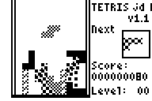

&nbsp;&nbsp;&nbsp;

# Tetris JD

An old TI83p assembly ([Z80](https://en.wikipedia.org/wiki/Zilog_Z80)) tetris clone I did a while back (~2006)

Source code: [tetrisjd.asm](tetrisjd.asm)

**LAUNCH THE GAME BY SELECTING THE PROGRAM TETRIS**

This was my first time in ASM and it poorly written (the source are included) but the graphics are great (I think).

The game is separate in two differents program, `TETRIS` (Launcher coded in [Basic](https://en.wikipedia.org/wiki/TI-BASIC)) and `TETRISJD` ([ASM](https://en.wikipedia.org/wiki/Assembly_language) game).
You can either play by launching `TETRIS` or enter the command `Asm(TETRISJD`.

I use two differents programs because when I included the Highscore feature, my tetris game just crash (it happen too when there was a Tetris Logo splash screen).
Oddly, it wasn't the code but it seem as if the program was getting to big (?), so the Highscore feature is now written as a separate program.

This game **doesn't need any OS at all** and should work juste fine on any TI-83+ (And possibly other Calc ?).

All piece are included, custom skin for each of them, speed increase at each level, highscore, etc. Anything you could expects for a Tetris game except no Music.

Control :

- `Enter`: Pause - Confirm
- `Left` and `Right` Arrows: Move Piece Horizontaly
- `Down`: Increase speed of the piece (Temporary)
- `Up` or `Graph`: Turn piece clockwise
- `Trace`: Turn Piece anti-clockwise
- `Clear`: Exit Game (Save Highscore but not the game)

Have Fun !
